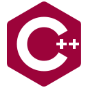
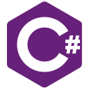
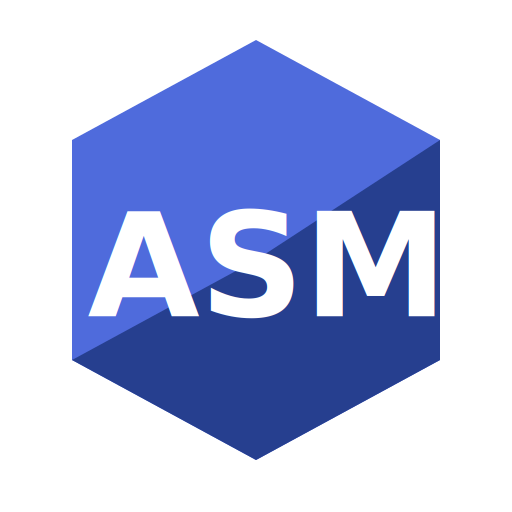
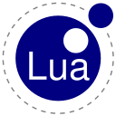
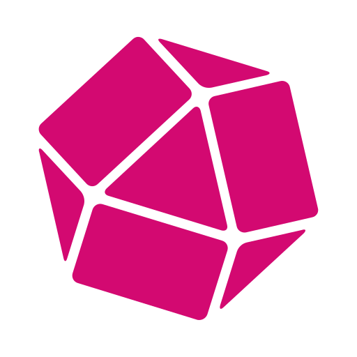
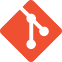
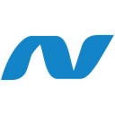

 # Hi there 👋 my name is Filippo Mecozzi 
 ## Software Architect and Developer

---
<!-- - 🖥️  See my portfolio at [PortafoglioNome](http://portafoglio) -->
- 🌍  I'm based in Italy
- 🖥️  Portfolio **COMING SOON!**
- 🔭  I’m going to work on a free Schedule App for Mobile in Dart soon
- 📫  You can contact me at [codesavant23@proton.me](mailto:codesavant23@proton.me)

_"But it is the spirit in a person, **the breath of the Almighty**,
that gives them understanding."_ - Job 32:8 (NIV)

---

I'm about to graduate with a Bachelor's degree in Computer Science from the University of Udine, where I focused on Internet of Things, Big Data, and Artificial Intelligence.

I've been passionate about software development since I was a kid (around 7–8 years old), and that passion led me to pursue a technical path in computer science.

Despite being early in my career, I've had the opportunity to explore a fairly wide range of technologies and programming languages.

Here's a non-exhaustive list:

### 💻 Programming Languages

### 🌐 Web & Markup

### 📊 Data & Statistics (Languages and Libraries)

### 🗄️ Databases

### 🧰 Misc

 

In addition, I have solid foundations in system administration and networking, with hands-on experience in common IoT protocols and paradigms.

## 👨‍🔧 Software Design

A special place in my interests is reserved for **software design**. I naturally tend to approach development from an architectural perspective rather than focusing only on implementation details.

Although I'm just about to graduate and haven't yet had formal industry experience, I've had the opportunity to work on practical projects involving the design of moderately complex systems, which helped me build a grounded foundation in software architecture.

Over the years, I’ve developed a strong understanding of Object-Oriented design principles, including Dependency Injection (with generics), 
and **SOLID principles** which I generally prefer over other approaches for their clarity, scalability, and maintainability.

<!--
**codesavant23/codesavant23** is a ✨ _special_ ✨ repository because its `README.md` (this file) appears on your GitHub profile.

Here are some ideas to get you started:

- 🔭 I’m currently working on ...
- 🌱 I’m currently learning ...
- 👯 I’m looking to collaborate on ...
- 🤔 I’m looking for help with ...
- 💬 Ask me about ...
- 📫 How to reach me: ...
- 😄 Pronouns: ...
- ⚡ Fun fact: ...
-->
